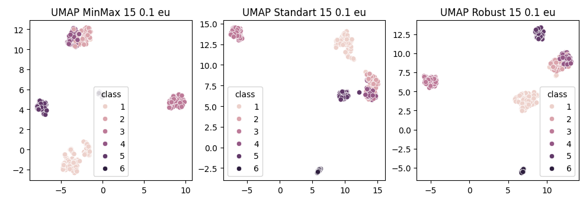

# Dimensionality-Reduction-and-Scalers-Comparison

This project compares various dimensionality reduction techniques and data scaling methods, applied to different datasets for visualization and analysis.

## 📊 Datasets
- Custom dataset loaded using **ucimlrepo**.
- **Mammoth dataset** (sampled for analysis).
  
## ⚙️ Algorithms and Techniques
- **Scaling Methods**: 
  - MinMax Scaling
  - Standard Scaling
  - Robust Scaling
- **Dimensionality Reduction Methods**: 
  - t-SNE
  - UMAP
  - TriMap
  - PaCMAP

## 🖼️ Results
Comparison of the effects of different scaling methods and dimensionality reduction techniques on the datasets.

Example of visualization:

Additionally, the results are evaluated using metrics like **Trustworthiness**, **Silhouette**, **ARI**, and **NMI**.
